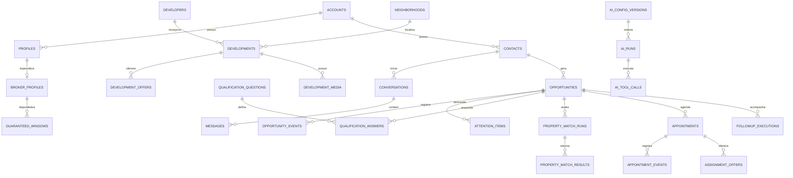

# Modelo de Dados Executável — Studiosp V1

Status: contrato técnico para orientar as migrations da V1
Documento funcional: [Especificação da Versão 1](./ESPECIFICACAO_V1_STUDIOSP.md)
Documento de produto: [Plano Mestre](./PLANO_MESTRE_STUDIOSP.md)

## 1. Objetivo

Este documento transforma a visão funcional da V1 em um modelo implementável no Supabase/Postgres. Ele define entidades, campos essenciais, relações, restrições, índices, permissões, operações atômicas e a migração da estrutura herdada do WACRM.

É a fonte de verdade para a criação das migrations. Mudanças relevantes no banco devem atualizar este documento e a especificação funcional no mesmo conjunto de alterações.

## 2. Princípios obrigatórios

### 2.1 Fronteira e identidade

- A Studiosp atende uma única operação na V1.
- `accounts` continua sendo a fronteira técnica e de segurança.
- Toda entidade de negócio possui `account_id NOT NULL`.
- O front não escolhe livremente a conta; ela é derivada da sessão.
- Chaves primárias usam `uuid` com `gen_random_uuid()`.
- Datas de eventos usam `timestamptz` em UTC e são exibidas no fuso da conta.

### 2.2 Valores e medidas

- Valores monetários usam `numeric(14,2)` e `currency char(3) DEFAULT 'BRL'`.
- Valores monetários não podem ser negativos.
- Áreas usam `numeric(10,2)` em metros quadrados.
- Confiança usa `numeric(5,4)` entre 0 e 1.
- O texto original informado pelo lead é preservado junto do valor normalizado.

### 2.3 Estados, eventos e integridade

- Estados canônicos são protegidos por `CHECK`; motivos configuráveis ficam em tabelas próprias.
- `opportunity_events` é a história imutável; `opportunities` é a projeção atual para leitura rápida.
- Nenhuma tela altera etapa sem registrar o evento correspondente.
- Chaves estrangeiras são explícitas e indexadas.
- Entidades operacionais são arquivadas; eventos, auditoria e mensagens não são apagados pelo painel.
- Restrições importantes vivem no banco, não apenas no front.

### 2.4 Segurança

- RLS fica ativa em toda tabela exposta pelo schema `public`.
- `service_role` existe apenas no servidor.
- Funções privilegiadas ficam em schema privado, com `search_path` explícito e grants mínimos.
- Mídias usam bucket privado e URLs assinadas de curta duração.
- Toda ação sensível registra autor, origem, data e correlação.

## 3. Visão das relações



## 4. Conta, usuários e corretores

### 4.1 Estruturas mantidas

`accounts` continua representando a operação e deve conter `name`, `timezone` (padrão `America/Sao_Paulo`), `currency` (padrão `BRL`) e timestamps.

`profiles` mantém a ligação com `auth.users`. Os papéis técnicos e seus nomes de interface são:

| Banco | Interface | Uso na V1 |
|---|---|---|
| `owner` | Dono | administração total |
| `admin` | Gestor | preservado, oculto por padrão |
| `agent` | Corretor | atendimento e operação comercial |
| `viewer` | Analista | preservado, oculto por padrão |

A V1 apresenta apenas Dono e Corretor, sem destruir a compatibilidade dos outros perfis.

### 4.2 `broker_profiles`

Especializa um perfil como corretor operacional.

| Campo | Tipo e regra |
|---|---|
| `id` | uuid, PK |
| `account_id` | uuid, FK, obrigatório |
| `profile_id` | uuid, FK, único por conta |
| `display_name` | text, obrigatório |
| `whatsapp_e164` | text, único por conta quando preenchido |
| `whatsapp_verified_at` | timestamptz, opcional |
| `max_parallel_assignments` | integer positivo, padrão 1 |
| `is_available`, `is_active` | boolean, padrão true |
| `last_assignment_at` | timestamptz, opcional |
| `created_at`, `updated_at` | timestamptz |

Tokens de Google ou UAZAPI não ficam em colunas expostas ao cliente. Credenciais ficam em secrets ou estrutura criptografada acessível apenas pelo servidor.

## 5. Contato, conversa e oportunidade

### 5.1 Fontes herdadas

`contacts`, `conversations` e `messages` continuam sendo fontes de verdade. Devem preservar:

- telefone E.164 e identificador do provedor;
- origem, campanha, conjunto e anúncio quando disponíveis;
- conteúdo original, tipo de mídia, direção, autor e horário do provedor;
- autoria entre lead, IA, corretor e sistema.

Mensagens têm chave única `(account_id, connection_id, provider_message_id)` para tornar webhooks repetidos idempotentes.

### 5.2 `opportunities`

Representa a intenção comercial. Na V1, um contato possui somente uma oportunidade ativa, mas pode manter encerradas no histórico.

| Campo | Tipo e regra |
|---|---|
| `id`, `account_id`, `contact_id` | uuid; PK e FKs obrigatórias |
| `primary_conversation_id` | uuid, FK opcional |
| `stage` | text, estado canônico |
| `attention_state` | text, estado transversal |
| `assigned_broker_id` | uuid, FK opcional |
| `qualification_status` | `not_started`, `in_progress`, `completed`, `needs_review` |
| `meeting_status`, `commercial_status` | text, projeções resumidas |
| `source_type` | `meta_ads`, `manual`, `referral`, `google_ads`, `other` |
| `source_metadata` | jsonb, padrão `{}` |
| `lost_reason_id`, `lost_notes` | motivo configurável e detalhe opcional |
| `won_gross_value` | numeric(14,2), opcional e não negativo |
| `currency` | char(3), padrão `BRL` |
| `last_lead_message_at`, `last_outbound_message_at` | timestamptz, projeções |
| `next_action_at`, `stage_changed_at`, `closed_at` | timestamptz |
| `created_at`, `updated_at` | timestamptz |

Estados de `stage`:

```text
received, contacting, qualifying, qualified, awaiting_schedule,
meeting_scheduled, meeting_completed, proposal_sent, negotiating,
contract_pending, won, lost
```

Estados de atenção:

```text
normal, waiting_lead, waiting_broker, human_attention, blocked
```

Restrição parcial:

```text
UNIQUE (account_id, contact_id)
WHERE stage NOT IN ('won', 'lost')
```

### 5.3 `opportunity_events`

Histórico append-only que explica qualquer alteração.

| Campo | Tipo e regra |
|---|---|
| `id`, `account_id`, `opportunity_id` | uuid, PK/FKs |
| `event_type` | text, obrigatório |
| `from_stage`, `to_stage` | text, opcionais |
| `actor_type` | `lead`, `ai`, `user`, `system`, `integration` |
| `actor_profile_id` | uuid, opcional |
| `source_type` | `whatsapp`, `dashboard`, `job`, `webhook`, `migration` |
| `source_id` | text, referência externa opcional |
| `idempotency_key` | text, único por conta quando preenchido |
| `payload` | jsonb, detalhes versionados |
| `correlation_id` | uuid, obrigatório |
| `occurred_at`, `created_at` | timestamptz |

Eventos iniciais incluem criação, início e conclusão da qualificação, resposta registrada, matching, preferência de agenda, reserva, aceite/rejeição/transferência, cancelamento, reunião realizada, ausência, proposta, negociação, contrato, venda, perda e handoff humano.

Usuários do painel não recebem permissão de `UPDATE` ou `DELETE` nessa tabela.

### 5.4 `attention_items`

Centraliza tudo que exige ação humana.

| Campo | Tipo e regra |
|---|---|
| `id`, `account_id`, `opportunity_id` | uuid, PK/FKs |
| `assigned_profile_id`, `assigned_role` | destino opcional |
| `kind` | text, motivo canônico |
| `severity` | `info`, `warning`, `critical` |
| `status` | `open`, `snoozed`, `resolved`, `cancelled` |
| `title`, `context` | text e jsonb |
| `due_at`, `snoozed_until`, `resolved_at` | timestamptz opcionais |
| `resolved_by`, `resolution` | uuid e jsonb opcionais |
| `deduplication_key` | text |
| `created_at`, `updated_at` | timestamptz |

Uma restrição parcial impede dois itens abertos com a mesma `deduplication_key`.

## 6. Qualificação configurável

### 6.1 `qualification_questions`

É o contrato entre o painel do dono, a conversa da IA e o dado normalizado.

| Campo | Tipo e regra |
|---|---|
| `id`, `account_id` | uuid |
| `key` | text estável, único por conta |
| `label`, `prompt_instruction` | text |
| `data_type` | `text`, `single_choice`, `multi_choice`, `money_range`, `location`, `date_range`, `boolean` |
| `normalization_strategy` | text controlado |
| `is_required`, `is_system`, `is_active` | boolean |
| `display_order` | integer |
| `validation_schema` | jsonb |
| `created_at`, `updated_at` | timestamptz |

Perguntas do sistema aceitam edição de texto, ordem e orientação, mas sua `key` e seu tipo não são alteráveis livremente.

### 6.2 `qualification_question_options`

Contém `question_id`, `value` estável, `label`, `aliases`, `display_order` e `is_active`. A combinação `(question_id, value)` é única.

### 6.3 `qualification_answers`

Cada extração gera uma versão; somente uma é atual por pergunta e oportunidade.

| Campo | Tipo e regra |
|---|---|
| `id`, `account_id`, `opportunity_id`, `question_id` | uuid |
| `version` | integer crescente |
| `status` | `provisional`, `confirmed`, `rejected`, `superseded` |
| `raw_text` | resposta original |
| `normalized_value` | jsonb conforme o tipo |
| `confidence` | numeric(5,4), 0 a 1 |
| `source_message_id`, `extracted_by_run_id` | uuid opcionais |
| `confirmed_by`, `confirmed_at` | uuid e timestamptz opcionais |
| `is_current` | boolean |
| `created_at` | timestamptz |

Restrição parcial:

```text
UNIQUE (opportunity_id, question_id) WHERE is_current = true
```

Perguntas canônicas semeadas:

- `purchase_objective`;
- `preferred_locations`;
- `entry_budget`;
- `monthly_installment_budget`;
- `total_price_budget`;
- `property_timing`;
- `purchase_urgency`;
- `schedule_preference`.

O preço total é desejável, mas não bloqueia a conclusão quando entrada ou parcela está confirmada.

## 7. Configuração e execução da IA

### 7.1 `ai_config_versions`

Versões imutáveis da configuração efetiva: `version`, `status`, `communication_prompt`, `system_policy_version`, `model_config`, `tool_policy`, `qualification_snapshot`, autor, publicação e timestamps. Somente uma versão fica `active` por conta.

O prompt de comunicação é editável pelo dono. As regras de segurança, escopo e ferramentas são protegidas no servidor.

### 7.2 `ai_runs`

Cada decisão ou geração registra:

- oportunidade, conversa e mensagem disparadora;
- versão de configuração;
- finalidade, provedor, modelo e status;
- fingerprint da entrada e saída estruturada;
- tokens, custo estimado e latência;
- erro sanitizado;
- `correlation_id`, início, conclusão e criação.

O conteúdo integral das mensagens não precisa ser duplicado nos logs; IDs e fingerprints reduzem exposição.

### 7.3 `ai_tool_calls`

Registra `ai_run_id`, ferramenta, argumentos sanitizados, status, resultado validado, chave idempotente e timestamps. A IA solicita ações; funções controladas validam e executam.

### 7.4 `audio_transcriptions`

Uma transcrição por mensagem, com `status`, `language`, `transcript`, `confidence`, duração, metadados sem credenciais e timestamps. Estados: `queued`, `processing`, `completed`, `failed`.

## 8. Follow-up

### 8.1 `followup_policies`

Versões publicáveis com nome, fuso, dias permitidos, janela diária e `steps` validados. Estados: `draft`, `active`, `archived`; somente uma versão ativa por escopo.

### 8.2 `followup_executions`

| Campo | Tipo e regra |
|---|---|
| IDs de conta, oportunidade e política | uuid, obrigatórios |
| `step_number` | integer |
| `status` | `scheduled`, `claimed`, `sent`, `cancelled`, `failed` |
| `scheduled_for`, `claimed_at` | timestamptz |
| `sent_message_id`, `cancel_reason` | opcionais |
| `idempotency_key` | único por conta |
| `attempt_count`, `last_error` | controle técnico |
| timestamps | criação e atualização |

Resposta do lead, opt-out, encerramento ou handoff cancela execuções ainda não enviadas.

## 9. Catálogo de empreendimentos

### 9.1 `developers`

Incorporadoras com `name`, `normalized_name`, descrição, site, contato estruturado, logotipo, status e timestamps. Nome normalizado é único por conta enquanto ativo.

### 9.2 `neighborhoods` e `neighborhood_aliases`

`neighborhoods` guarda nome, nome normalizado, cidade, UF, região, coordenadas opcionais e status. A chave natural é `(account_id, normalized_name, city, state_code)`.

Aliases ligam grafias alternativas ao bairro. Alias ambíguo não escolhe silenciosamente: a IA pede confirmação.

### 9.3 `developments`

| Campo | Tipo e regra |
|---|---|
| IDs de conta, incorporadora e bairro | uuid, obrigatórios |
| `name`, `normalized_name`, `internal_code` | text |
| `description`, `address` | text e jsonb |
| `latitude`, `longitude` | numeric opcionais |
| `property_timing` | `off_plan`, `ready`, `both` |
| `expected_delivery_date` | date opcional |
| `highlights` | text[] |
| `knowledge_notes` | contexto permitido para IA |
| `internal_notes` | nunca enviado à IA de contato |
| `status` | `draft`, `published`, `paused`, `archived` |
| `terms_valid_until`, `cover_media_id` | opcionais |
| autores e timestamps | obrigatórios |

Publicação exige incorporadora ativa, bairro ativo, descrição e pelo menos uma oferta ativa. Somente publicados participam do matching.

### 9.4 `development_offers`

Representa faixas comerciais, não unidades individuais.

| Campo | Tipo e regra |
|---|---|
| `development_id`, `account_id` | uuid |
| `label` | exemplo `Studio 30 m²` |
| `area_min_sqm`, `area_max_sqm` | numeric(10,2) |
| `price_from`, `price_to` | numeric(14,2) |
| `entry_from`, `entry_to` | numeric(14,2) |
| `installment_from`, `installment_to` | numeric(14,2) |
| `currency` | `BRL` na V1 |
| `terms_summary` | text |
| `property_timing` | `off_plan`, `ready`, `both` |
| `valid_from`, `valid_until` | date |
| `is_active`, `display_order` | boolean e integer |
| timestamps | criação e atualização |

Mínimos não podem superar máximos. Oferta vencida não participa do matching ativo.

## 10. Biblioteca privada de mídias

### 10.1 Storage

Bucket alvo: `development-media`, privado. Caminho:

```text
{account_id}/{development_id}/{media_id}/v{version}/{safe_filename}
```

O caminho nunca é sobrescrito; uma substituição cria nova versão.

### 10.2 `development_media`

Guarda empreendimento, tipo (`image`, `video`, `document`, `floor_plan`, `presentation`), categoria, título, descrição, visibilidade (`owner_only`, `broker`, `shareable`), status, capa, ordem, versão atual, autor, arquivamento e timestamps.

Um índice parcial garante uma única capa ativa por empreendimento.

### 10.3 `development_media_versions`

Guarda `media_id`, número da versão, bucket, caminho único, nome original, MIME, tamanho, checksum SHA-256, dimensões ou duração, metadados de processamento, autor e criação.

Restrições únicas: `(media_id, version)` e `(bucket_id, object_path)`.

### 10.4 Upload de pasta

O navegador envia arquivos e caminhos relativos. O servidor:

1. valida extensão, MIME, tamanho e quantidade;
2. cria registros em lote e caminhos únicos;
3. gera autorizações de upload;
4. acompanha estado individual;
5. retoma somente arquivos que falharam;
6. conclui a pasta sem perder o que já foi processado.

Arquivos grandes usam upload retomável. O Postgres guarda metadados, nunca o binário.

## 11. Matching

### 11.1 `property_match_runs`

Registra oportunidade, snapshot da qualificação, corte do catálogo, versão das regras, status, pontuação mínima, quantidade e timestamps.

### 11.2 `property_match_results`

Registra execução, empreendimento, melhor oferta, score de 0 a 100, posição, decomposição auditável, razões positivas e alertas.

Restrições únicas: `(match_run_id, development_id)` e `(match_run_id, rank)`.

O lead recebe apenas a contagem de oportunidades compatíveis. O corretor atribuído recebe os resultados e o resumo permitido.

## 12. Agenda, reserva e atribuição

### 12.1 `scheduling_policies`

Versões publicáveis com:

- duração padrão de 10 minutos;
- intervalo de 5 minutos;
- antecedência mínima de 120 minutos;
- horizonte de 7 dias;
- SLA inicial do corretor de 15 minutos;
- lembrete após mais 15 minutos;
- antecedência de cancelamento ao lead de 180 minutos;
- fuso e round-robin.

Todos são configuráveis pelo dono, com limites seguros.

### 12.2 `guaranteed_windows`

Guarda corretor, dia da semana, início, fim, intervalo de slots, capacidade, vigência e status. Janelas ativas do mesmo corretor não se sobrepõem.

### 12.3 `availability_exceptions`

Bloqueios ou capacidade extra por corretor, com início, fim, motivo, autor e timestamps.

### 12.4 `appointments`

| Campo | Tipo e regra |
|---|---|
| IDs de conta, oportunidade, corretor e política | uuid |
| `status` | estado da reunião |
| `starts_at`, `ends_at`, `timezone` | horário reservado |
| `channel` | `video`, `phone`, `undefined` |
| `meeting_url` | opcional |
| confirmações do lead e do corretor | timestamptz |
| provedor e ID externo do calendário | opcionais na V1 |
| `cancel_reason` | opcional |
| timestamps | criação e atualização |

Estados:

```text
reserved, broker_confirmed, completed, no_show, cancelled,
reschedule_requested, rescheduled
```

A V1 considera uma reunião principal ativa por oportunidade. Reagendamento preserva registros anteriores.

### 12.5 `appointment_events`

Histórico append-only com ator, origem, chave idempotente, payload, correlação e horários.

### 12.6 `assignment_offers`

Registra reunião, corretor, ordem da tentativa, canal (`dashboard`, `whatsapp`, `both`), status, oferta, expiração, resposta, motivo e mensagem relacionada. Rejeição ou transferência exige motivo.

Somente uma oferta pendente por reunião/corretor. Aceite encerra ofertas concorrentes.

### 12.7 `broker_operational_conversations`

Liga o WhatsApp cadastrado do corretor à conexão da empresa e ao chat remoto. Mensagens naturais são convertidas em ações estruturadas e validadas contra ofertas pendentes; texto livre nunca altera diretamente o banco.

## 13. Auditoria e motivos

### 13.1 `audit_events`

Evento append-only com conta, ator, ação, tipo e ID da entidade, dados anteriores e posteriores sanitizados, motivo, correlação e criação. Tokens, secrets e URLs assinadas nunca entram na auditoria.

### 13.2 `reason_definitions`

Catálogo configurável de motivos de perda, rejeição, transferência, cancelamento e exceção. Possui `category`, `code`, `label`, `requires_notes`, status e ordem. Código é único por conta e categoria.

## 14. Índices obrigatórios

Todos os FKs recebem índice. Além deles:

| Tabela | Índice principal | Uso |
|---|---|---|
| `opportunities` | `(account_id, stage, stage_changed_at DESC, id DESC)` | funil |
| `opportunities` | `(account_id, assigned_broker_id, stage, updated_at DESC)` | carteira |
| `opportunities` | `(account_id, attention_state, next_action_at)` | SLA |
| `opportunity_events` | `(opportunity_id, occurred_at DESC, id DESC)` | linha do tempo |
| `attention_items` | parcial `(account_id, due_at, severity)` onde aberto | atenção |
| `qualification_answers` | `(opportunity_id, question_id, version DESC)` | histórico |
| `messages` | `(conversation_id, created_at DESC, id DESC)` | conversa |
| `followup_executions` | parcial `(scheduled_for, id)` onde agendado | workers |
| `developments` | `(account_id, status, neighborhood_id, developer_id)` | catálogo |
| `development_offers` | parcial `(development_id, valid_until)` onde ativa | matching |
| `development_media` | `(development_id, status, display_order)` | galeria |
| `property_match_results` | `(match_run_id, rank)` | ranking |
| `appointments` | `(account_id, broker_profile_id, starts_at, ends_at)` | agenda |
| `assignment_offers` | parcial `(expires_at, id)` onde pendente | SLA |
| `ai_runs`, `audit_events` | `(account_id, created_at DESC, id DESC)` | diagnóstico |

Listas longas usam paginação por cursor com `(created_at, id)`, nunca `OFFSET` profundo.

## 15. Operações atômicas

### 15.1 Criar oportunidade

Em uma transação curta: normaliza/encontra o contato, procura oportunidade ativa, cria somente se não existir, registra `opportunity_created` com idempotência e retorna o registro. O índice parcial resolve concorrência entre webhooks.

### 15.2 Aplicar evento

Uma função controlada recebe oportunidade, evento, estado esperado, ator, origem, payload, idempotência e correlação. Na mesma transação, bloqueia a oportunidade, valida a transição, insere o evento e atualiza a projeção. Chamadas externas não acontecem dentro da transação.

### 15.3 Reservar horário garantido

Em uma transação:

1. valida política, antecedência, horizonte e exceções;
2. bloqueia a capacidade do slot;
3. verifica compromissos ativos do corretor;
4. cria a reunião como `reserved`;
5. registra eventos e oferta inicial;
6. confirma a transação;
7. somente depois agenda mensagens externas.

A capacidade deve ser materializada por slot ou protegida por restrição de exclusão compatível com `capacity_per_slot`. Uma simples consulta seguida de insert não é suficiente.

### 15.4 Aceitar, rejeitar ou transferir

- A ação deve referenciar oferta pendente e não expirada.
- Aceite bloqueia a reunião e encerra ofertas concorrentes.
- Rejeição exige motivo.
- Transferência cria nova oferta e preserva a anterior.
- O corretor não altera valores de venda pelo WhatsApp na V1.

## 16. Filas e concorrência

Workers reivindicam lotes com transações curtas e `FOR UPDATE SKIP LOCKED`. Itens possuem status, disponibilidade, tentativas, reivindicação, erro, idempotência e correlação.

Regras:

- rede e IA são chamadas fora da transação de reivindicação;
- sucesso ou falha é persistido depois;
- timeout devolve item abandonado;
- falha definitiva abre `attention_item` sem duplicidade;
- toda saída para WhatsApp usa idempotência própria;
- jobs não varrem tabelas inteiras sem índice parcial de pendência.

## 17. Matriz de acesso por RLS

| Domínio | Dono | Corretor | Servidor IA/webhook |
|---|---|---|---|
| Conta e configurações | administra | mínimo necessário | operação controlada |
| Usuários/corretores | administra | próprio perfil | controlado |
| Contatos e conversas | todos da conta | atribuídos | controlado |
| Oportunidades | administra | atribuídas | por função |
| Eventos | lê | lê atribuídos | append-only |
| Central de atenção | administra | atribuída | cria/resolve por regra |
| Perguntas e prompts | administra | lê efetivo | lê versão ativa |
| Respostas | administra | lê atribuídas | por função |
| Catálogo | administra | publicados | publicados |
| Mídias | administra | conforme visibilidade | URL temporária |
| Matching | administra | atribuídos | controlado |
| Agenda/ofertas | administra | próprias | por função |
| Custos e logs de IA | administra | sem acesso | controlado |
| Auditoria | lê | sem acesso | append-only |

Padrão de política:

```text
authenticated
AND account_id = private.current_account_id()
AND regra_de_papel_ou_atribuicao
```

Funções usadas em RLS evitam consultas repetidas e as colunas avaliadas recebem índices. Grants explícitos removem permissões desnecessárias; RLS não substitui grants mínimos.

## 18. Storage e privacidade

- `development-media` é privado.
- Dono administra arquivos da própria conta.
- Corretor obtém URL assinada apenas de mídia `broker` ou `shareable` em empreendimento publicado.
- O lead não acessa o bucket diretamente na V1.
- Objetos órfãos só são removidos após carência e auditoria.
- O bucket público `product-media` herdado deixa de receber uploads.
- A migração para privado ocorre antes de remover caminhos antigos.

## 19. Migração do modelo atual

| Atual | Alvo | Estratégia |
|---|---|---|
| `deals` | `opportunities` | backfill incremental |
| pipeline | `opportunity_events` | evento inicial e novos eventos |
| `conversation_sdr_state` | `qualification_answers` | campos conhecidos + JSON original |
| `recommended_product_ids` | match runs/results | importar como legado |
| `products` | developments/offers | separar empreendimento e faixa |
| `product_media` | media/versions | copiar ao bucket privado com checksum |
| notificações | `attention_items` | somente pendências úteis |
| configuração de IA | `ai_config_versions` | snapshot inicial |
| logs de IA | `ai_runs` e eventos | adaptar leitura antes de descontinuar |

Sequência segura:

1. criar estruturas novas sem remover antigas;
2. semear perguntas, estados, motivos e políticas padrão;
3. fazer backfill idempotente por lotes;
4. comparar contagens, amostras e totais;
5. ativar leitura nova atrás de flag;
6. mudar escrita por domínio;
7. observar divergências;
8. congelar escrita antiga;
9. retirar telas antigas;
10. arquivar somente após período de segurança.

Escrita dupla é exceção e deve ter data para acabar.

## 20. Retenção

- Oportunidades encerradas permanecem no histórico.
- Uma futura recompra cria nova oportunidade sem apagar a anterior.
- Logs técnicos detalhados podem ser resumidos após prazo operacional.
- Auditoria, eventos comerciais e confirmações permanecem por prazo maior.
- Anonimização deve preservar métricas agregadas quando permitido.
- Não existe exclusão física em massa pelo painel da V1.

Prazos exatos serão configurados antes da produção e validados juridicamente; não serão inventados pelo código.

## 21. Critérios de aceite do banco

O modelo só está pronto quando:

1. concorrência não cria duas oportunidades ativas;
2. webhook repetido não duplica mensagem nem evento;
3. transição inválida é recusada;
4. toda mudança de etapa possui evento;
5. corretor não lê lead de outro corretor;
6. corretor lê apenas mídia permitida;
7. arquivo privado exige URL assinada;
8. reservas simultâneas não excedem capacidade;
9. rejeição ou transferência sem motivo é recusada;
10. resposta atual é única e histórico é preservado;
11. follow-up cancelado não é enviado;
12. falha definitiva abre atenção sem duplicidade;
13. execução da IA registra configuração, custo e correlação;
14. workers não se bloqueiam entre si;
15. todas as tabelas públicas têm RLS testada entre contas;
16. migração de mídia preserva checksum e vínculo;
17. nenhuma credencial chega ao navegador;
18. restore de backup é testado antes do corte.

## 22. Ordem das migrations

1. funções privadas de identidade, timestamps e auditoria;
2. ajustes em conta e perfis;
3. corretores e motivos;
4. oportunidades, eventos e atenção;
5. qualificação, IA e transcrição;
6. follow-up;
7. incorporadoras, bairros, empreendimentos e ofertas;
8. mídias e Storage;
9. matching;
10. políticas, janelas e exceções de agenda;
11. reuniões, eventos e ofertas;
12. índices, grants e RLS;
13. seeds;
14. backfills;
15. testes SQL de integridade, concorrência e isolamento.

Operações destrutivas ficam em migrations separadas e posteriores ao período de compatibilidade.

## 23. Decisões adiadas

Ficam fora do modelo ativo da V1:

- oportunidades simultâneas por contato;
- várias reuniões independentes por oportunidade;
- estoque por unidade individual;
- comissões e repasses;
- Google Calendar bidirecional;
- atribuição avançada por especialidade ou performance;
- enriquecimento de mídia com IA;
- produto SaaS multiempresa.

As chaves e relações escolhidas permitem adicionar essas capacidades sem reescrever o histórico.
